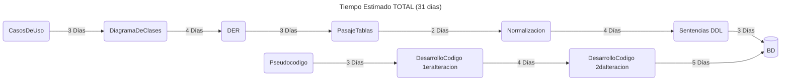

#Diagrama de PERT

```mermaid
---
title: Tiempo Estimado TOTAL (31 dias)
---
graph LR;

      ordersDB[(BD)];
1(CasosDeUso)--->|3 Días|2;
2(DiagramaDeClases)--->|4 Días|3;
3(DER)--->|3 Días|4;
4(PasajeTablas)--->|2 Días|5;
5(Normalizacion)--->|4 Días|6;
6(Sentencias DDL)-->|3 Días|ordersDB;
7(Pseudocodigo)--->|3 Días|8;
8(DesarrolloCodigo 1eraIteracion)--->|4 Días|9;
9(DesarrolloCodigo 2daIteracion)--->|5 Días|ordersDB;

```
